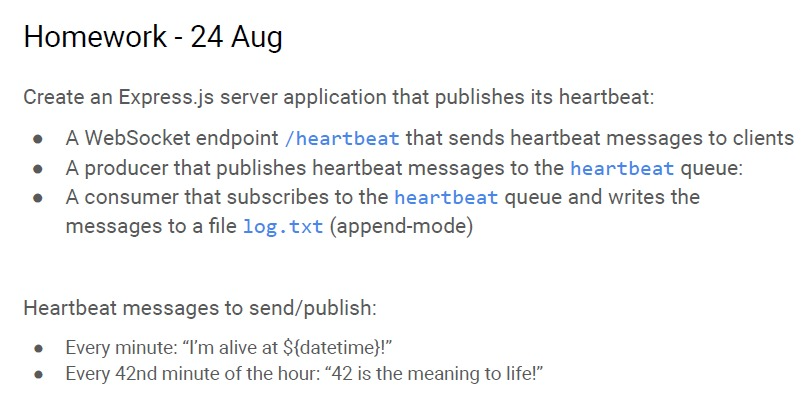

# Backend Dev homework on 24 Aug 2021

 

# Setup

```bash
$ npm install

# to start the webserver and websocket server
# webserver listening at port 5000
# websocket listening at port 3030
$ node producer.js

# to start the consumer
$ node consumer.js
```

Open browser at http://localhost:5000/heartbeat


p.s. Please set environment variable ENV="dev" in .env file for heartbeat at Seconds, otherwise for heartbeat will be at Minutes

